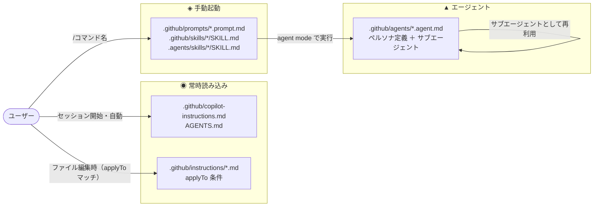
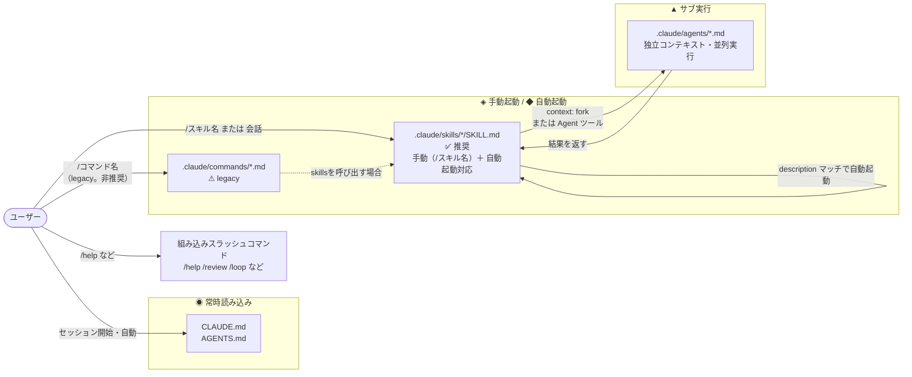

# GitHub Copilot と Claude Code のプロンプト・スキル・エージェント機能の比較（2026年5月版）

GitHub Copilot と Claude Code はどちらもエディタ統合型のAIコーディングアシスタントですが、カスタマイズの仕組みが異なり、いつも混乱してしまうので、Claude Sonnet 4.6 に整理してもらいました。  
備忘録として 2026.5時点での「カスタム指示・プロンプト・スキル・エージェント」の仕様を書いておきます。

Claude Code の `commands/` って、いつの間にか `skills/` に統合されて非推奨になっていたんですね。

> **情報の鮮度について**
> 本記事は 2026年5月時点の情報に基づいています。両ツールともアップデートが頻繁なため、最新の公式ドキュメントも必ず参照してください。

---

## サマリ情報

### 全体像の比較

このセクションでは、Claude Code と GitHub Copilot Chat のカスタム指示・コマンド・エージェントの読み込みタイミングと起動方法をまとめています。特に「常時読み込み」「/コマンド呼び出し」「文脈による自動起動」という3つの観点で違いを整理しています。

---

| カテゴリ | Claude Code | VS Code GitHub Copilot Chat |
|---|---|---|
| **適用ルール** | `CLAUDE.md`<br>セッションに常時注入。グローバル＋プロジェクトの2層でマージされるルール | `.github/copilot-instructions.md`（リポジトリ単位で注入）<br>`.github/instructions/*.instructions.md`（`applyTo` に記述している条件に一致するファイルで読み込まれる。） |
| **/コマンド** | `.claude/skills/*/SKILL.md` **（推奨）**<br>`.claude/commands/*.md`（legacy）<br>単純〜複雑なワークフロー両対応 | `.github/prompts/*.prompt.md`<br>`.github/skills/*/SKILL.md` / `.agents/skills/*/SKILL.md`<br>VS Code Copilot Chat の `/` スラッシュコマンド |
| **キーフレーズ** | `.claude/skills/*/SKILL.md`（description 重要）<br>Claude が description を読んで文脈に応じて自動ロード | `.github/instructions/*.instructions.md`（`applyTo` 指定で該当ファイルに自動適用）<br>`.github/copilot-instructions.md` は常時適用のルールとして注入される。<br>`/` コマンド（`.github/prompts/*.prompt.md` / `SKILL.md`）は通常手動起動だが、Agent Mode の description やファイルパターンにより自動提案／自動起動されることがある（環境依存）。 |
| **ペルソナ切り替え** | ⚠ 専用機能なし<br>`CLAUDE.md` 直書き / `skills/persona.xxx` / シムリンク切り替えで代替 | `.github/agents/*.agent.md`<br>役割・ツール・モデルを定義。Planner / Reviewer など会話全体を制御 |
| ▲ **並列サブ実行** | `.claude/agents/*.md`<br>サブエージェント定義。<br>独立コンテキストで並列実行。<br>主な起動方法：`@agent-<name>` / `@<name>`（@メンション）、`/agents` 管理画面、`claude --agent <name>`（CLI）、`context: fork` を持つ `SKILL.md` 経由の実行、および Claude の自動デリゲーション。 | `.github/agents/`<br>エージェント定義ファイル。<br>独立コンテキストで並列実行されることが多い（Agent Mode）。<br>主な起動方法：Copilot Chat のエージェント選択（Agent Mode）から起動、`/` スラッシュコマンドで `SKILL.md` を直接実行（スキルは `/` で呼び出し）、エージェント実行時に参照される `AGENTS.md`、個人スキルは `~/.copilot/skills/` または `~/.agents/skills/` から。|
| ■ **スコープ** | `~/.claude/skills/`（個人・全PJ横断）<br>`.claude/skills/`（PJ固有）<br>競合時はプロジェクト側が優先 | `.github/` リポジトリ<br>プロジェクト共有のカスタム指示 / prompt / skills<br>個人スキルは `~/.copilot/skills/` / `~/.agents/skills/` |
| ■ **補助データ** | `.claude/skills/xxx.templates/`（`SKILL.md` なし）<br>コマンド化しない参照専用データ置き場 | `.github/prompts/` 内 Markdown リンク参照<br>`prompt.md` から `../docs/standards.md` のようにリンク |

> **▲ 並列サブ実行とは**
>
> メインのAIエージェントが複数の子エージェント（サブエージェント）を生成し、それぞれが**独立したコンテキスト（会話履歴）**を持ちながら**同時並行で動く**仕組みです。
>
> 各サブエージェントはメインの会話履歴を持たない独立したコンテキストで起動されます。大規模なコードベースの解析や複数ファイルへの同時変更など、逐次実行では時間がかかるタスクを効率よく処理できます。
>
> **Claude Code の場合**（「どのコンテキストで動かすか」を設計する）
>
> `context: fork` でサブエージェントをメイン会話から切り離して実行します。大規模な調査や実装をメインの会話履歴を汚染せずに委譲できます。
>
> ```
> メインエージェント
>   ├── Explore エージェント (context: fork) → コードベースを調査して結果を返す
>   ├── Plan エージェント    (context: fork) → 設計書を作成して結果を返す
>   └── general-purpose      (context: fork) → 実装して結果を返す
>         ↓
>   各結果をメインが集約して回答
> ```
>
> **GitHub Copilot の場合**（「どのモデル・ツールで動かすか」を設計する）
>
> `.github/agents/*.agent.md` でペルソナごとにモデルと使用ツールを指定できます。タスクの性質に合わせて最適なモデルを使い分けられます。
>
> ```
> メインエージェント (Agent Mode)
>   ├── designer.agent.md  (モデル: o3)                          → アーキテクチャ設計
>   ├── coder.agent.md     (モデル: Claude Sonnet, ツール: terminal) → 実装
>   └── reviewer.agent.md  (モデル: GPT-4o, ツール: web検索)    → ベストプラクティス確認
>         ↓
>   各結果をメインが集約して回答
> ```
>
> **両者の違い**
>
> | 比較軸 | Claude Code | GitHub Copilot |
> |--------|------------|----------------|
> | 設計の主眼 | **どのコンテキストで動かすか** | **どのモデル・ツールで動かすか** |
> | 制御方法 | `context: fork` で明示的に分岐 | Agent Mode 経由（環境依存） |
> | 定義ファイル | `.claude/agents/*.md` | `.github/agents/*.agent.md` |
> | 定義できる内容 | サブエージェントへの指示 | ペルソナ・使用ツール・モデルまで定義可能 |
> | 自動デリゲーション | Claude が description を見て自動で委譲 | 主にユーザーが Agent Mode で選択して起動 |

---

### 機能対応表（詳細）

#### カスタム指示系

| ファイル | Copilot | Claude Code | 適用タイミング |
|----------|:-------:|:-----------:|----------------|
| `.github/copilot-instructions.md` | ✅ | ❌ | 常時（Copilot専用） |
| `.github/instructions/*.instructions.md` | ✅ | ❌ | applyTo条件一致時 |
| `AGENTS.md` | ✅ | ✅ | 常時（マルチエージェント共通） |
| `CLAUDE.md` | ❌ | ✅ | 常時（Claude Code専用） |

#### スキル・プロンプト系

| 機能 | Copilot | Claude Code | 備考 |
|------|:-------:|:-----------:|------|
| `SKILL.md`（Agent Skills Open Standard） | ✅ | ✅ | スキルの共通形式 |
| `.prompt.md`（手動起動プロンプト） | ✅ | ❌ | Copilot専用（スキルで代替可） |
| スキル自動起動 | ✅ | ✅ | description ベースで自動起動 |
| スキル手動起動（スラッシュコマンド） | ✅ | ✅ | `/スキル名` |
| `context: fork`（サブエージェント分離） | ❌ | ✅ | Claude Code独自拡張 |
| `agent:` フィールド | ❌ | ✅ | Claude Code独自拡張 |

---

### まとめ

GitHub Copilot と Claude Code のカスタマイズ機能を整理すると、次のような設計思想の違いが見えてきます。

- **GitHub Copilot**：IDE に深く統合されたフロー重視の設計。ファイル種別ごとの細かい指示切り替えが得意。
- **Claude Code**：ターミナルファーストの自律エージェント設計。`context: fork` によるサブエージェント分離など、大規模・複雑なタスクの委譲に強み。

どちらが優れているかではなく、**タスクの性質に応じて使い分け**、あるいは**両方を組み合わせる**のが 2026年現在のベストプラクティスです。Claude Code は Copilot Pro+ / Enterprise プランから外部エージェントとして呼び出せるようになっているため、Copilot ワークフローの中から Claude Code に委譲する構成も可能です。（※ 要出典。公式発表の確認を推奨します）

---

## GitHub Copilot のカスタマイズ機能

GitHub Copilot のカスタマイズには「カスタム指示・プロンプトファイル・エージェントスキル・AGENTS.md」の4種類があります。それぞれ役割が異なります。

### 1. カスタム指示（Custom Instructions）

Copilot への常時適用ルールを記述するファイルです。
公式ドキュメントが明示している優先順位は3層です。すべての該当指示はモデルに渡されますが、矛盾がある場合は上位が優先されます。

```
個人設定（GitHub.com）  ← 最高優先
  ↓
リポジトリ設定（以下はすべてマージして提供）
  ・.github/copilot-instructions.md
  ・.github/instructions/*.instructions.md（applyTo 条件に合致するもの）
  ・AGENTS.md（エージェント実行時）
  ↓
組織設定  ← 最低優先
```

> **注意：** `.github/instructions/*.instructions.md` と `.github/copilot-instructions.md` の間に優先順位はありません。どちらも Repository instructions として両方提供されます。AGENTS.md はこの3層ヒエラルキーとは別枠で、エージェント実行時に参照されるものです。

#### `.github/copilot-instructions.md`（リポジトリ全体・常時ON）

リポジトリルートの `.github/` に置くだけで、そのリポジトリ上のすべてのリクエストに適用されます。

**記述例：** `.github/copilot-instructions.md`

```markdown
# Copilot Instructions

- TypeScript を使用する。any 型は禁止
- テストは Vitest で記述する
- コメントは日本語で書く
```

#### `.github/instructions/*.instructions.md`（パス指定・条件適用）

`applyTo` フロントマターでファイルパターンを指定すると、対象ファイルに対してのみ適用されます。

**記述例：** `.github/instructions/test.instructions.md`（テストファイル向け）

```markdown
---
applyTo: "**/*.test.ts"
---

# テストファイルのルール

- AAA パターン（Arrange / Act / Assert）で記述
- モックは vi.mock() を使用する
```

**記述例：** `.github/instructions/api.instructions.md`（API層向け）

```markdown
---
applyTo: "src/api/**"
---

# API層のルール

- 戻り値は必ず Result 型でラップする
- エラーは never throw、戻り値で表現
```

#### 個人設定

すべてのリポジトリに横断適用できる個人ルールはGitHub.com のアカウントに設定します。  
VS Code Copilot Chat で **`copilot-instructions.md` や `*.instructions.md` を個人ローカルに置いて管理する仕組みは、現時点では公式にサポートされていません。**
個人設定をローカルで使いたい場合は GitHub.com の Custom Instructions 設定を使う必要があります。

VS Code Copilot Chat の個人スキルは `~/.copilot/skills/` または `~/.agents/skills/` に配置します。これらは custom instructions とは別扱いで、`/` メニューから呼び出せます。

---

### 2. プロンプトファイル（Prompt Files）

**ファイル形式：** `.github/prompts/*.prompt.md`

カスタム指示が「常時適用」なのに対し、プロンプトファイルは `/{プロンプト名}` で実行する時に読み込まれます。
チャット欄で `/` を入力すると一覧が表示されます。

**対応環境：** VS Code / Visual Studio / JetBrains のみ（GitHub.com の Copilot は非対応）

**記述例：** `.github/prompts/review.prompt.md`

```markdown
# コードレビューチェックリスト

以下の観点でコードをレビューしてください。

- [ ] セキュリティ（インジェクション・認証漏れ）
- [ ] N+1問題
- [ ] テストカバレッジ
- [ ] 命名規則の一貫性

対象ファイル: {{selection}}
```

`{{selection}}` のようにテンプレート変数も利用できます。

---

### 3. AGENTS.md

**ファイル形式：** リポジトリルートまたは任意のサブディレクトリに `AGENTS.md`

**AGENTS.md** は GitHub Copilot Chat in VS Code を含む複数の AI エージェントで共通に使える汎用フォーマットです。
VS Code Copilot Chat ではリポジトリルートだけでなくネストした `AGENTS.md` もサポートされ、`.github/copilot-instructions.md`、`.github/instructions/*.instructions.md`、さらに `CLAUDE.md` / `GEMINI.md` などの汎用ファイルも並列で参照されます。（根拠: GitHub Changelog 2025-08-28）

`AGENTS.md` はリポジトリ内の `AGENTS.md` またはネストされた `AGENTS.md` を使います。
VS Code Copilot Chat の個人スキルは `~/.copilot/skills/` または `~/.agents/skills/` がサポート対象であり、`~/.github` は公式ドキュメントで Copilot Chat のスキル配置先としては定義されていません。

**記述例：** `AGENTS.md`

```markdown
# Project Agent Instructions

## セットアップ
npm install && npm run build

## テスト
npm test

## 注意事項
- 本番 DB に直接書き込まない
- .env ファイルは絶対にコミットしない
```

`.github/copilot-instructions.md` と `AGENTS.md` が共存する場合、Copilot は**両方を読みマージ**します。
複数エージェントで同じリポジトリを扱うなら AGENTS.md に共通ルールを書き、Copilot 固有の追加設定を `.github/copilot-instructions.md` に書く、という使い分けが推奨されています。

---

### 4. エージェントスキル（Agent Skills）

**ファイル形式：** `<任意のディレクトリ>/SKILL.md`

VS Code GitHub Copilot Chat のエージェントモード（agent mode）で使える、タスク特化型の能力定義です。
**Agent Skills Open Standard** に準拠しており、`.github/skills/`・`.agents/skills/` などのプロジェクトスキルを共有できます。

VS Code では、これらのスキルがチャットの `/` コマンドとして利用可能で、必要な時にのみ自動起動されます。
扱う全リポジトリに共通で反映したい場合(個人スキル)、 `~/.copilot/skills/` あるいは `~/.agents/skills/` に置きます。

**記述例：** `SKILL.md`（基本形式）

```markdown
---
name: generate-tests
description: 指定されたソースファイルのユニットテストを生成する
---

# テスト生成スキル

対象ファイルを読み込み、以下の手順でテストを生成してください。

1. public メソッドをすべて列挙
2. 各メソッドの正常系・異常系・境界値テストを作成
3. Vitest 形式で出力
```

#### `~/.copilot/skills/` と `~/.agents/skills/` の使い分け

公式ドキュメント（VS Code Docs・GitHub Docs）では、両パスは**機能的に等価な代替パス**として並列記載されており、動作の差異は一切明記されていません。どちらのパスでも同じ `SKILL.md` フォーマット（Agent Skills Open Standard）が使われます。

実用上の使い分け指針は以下のとおりです。

| パス | 想定用途（慣例） |
|---|---|
| `~/.copilot/skills/` | GitHub Copilot 専用として管理したいスキル |
| `~/.agents/skills/` | 複数のエージェント（Copilot・Claude Code など）で共有したいスキル |

これは命名上の慣例であり、機能的な差異はありません。
迷った場合は `~/.agents/skills/` を選ぶと、将来的に他のエージェント対応ツールと共有しやすくなります。
ただし、VSCode 1.122.0 で、Agent(~/.github/agents/)から `~/.agents/skills/` 下の Skill.md を読み込む構成にしていると、「ワークスペースにありません」となり、自動的に読み込んでくれません。
VSCode 1.122.0 時点の確認では、Agents がスキルを探すのは `.copilot` と `.claude` 配下に限られます。
そのため、VSCode を使用する場合は `~/.copilot/skills/` への配置を推奨します。

### 関係図



### 混乱しやすいポイント

#### prompt file vs custom instructions vs agent skills

| 比較軸 | Custom Instructions | Prompt Files | Agent Skills |
|--------|--------------------|--------------|----|
| 起動 | 常時自動 | 手動（`/` で呼ぶ） | 自動 or 手動（`/` で呼ぶ） |
| 目的 | コーディングスタイル・ルール定義 | タスクのテンプレート化 | 専門タスクの能力拡張 |
| 対象エージェント | Chat全般 | Chat（IDE内のみ） | VS Code Copilot Chat / エージェントモード |
| ファイル場所 | `.github/` | `.github/prompts/` | 任意（SKILL.md） |


**追記**
- `Prompt Files` は VS Code Copilot Chat の手動呼び出しプロンプトです。`.github/prompts/*.prompt.md` に配置し、`/` メニューから実行します。
- `Agent Skills` はより構造化された能力定義で、`.github/skills/` や `.agents/skills/` から読み込まれます。`Prompt Files` から `Agent Skills` を呼び出すのではなく、両者は同じ `/` メニューに並ぶ別カテゴリです。
- VS Code Copilot Chat の個人スキルは `~/.copilot/skills/` または `~/.agents/skills/` に配置します。`~/.github` は公式には Copilot Chat の個人スキル用ディレクトリとしては定義されていません。
- `.github/agents/*.agent.md` はスキルそのものではなく、エージェントの振る舞い・ツールセット・ロールを定義するエージェント定義です。

---

## Claude Code のカスタマイズ機能

Claude Code のカスタマイズは「CLAUDE.md・スキル・コマンド・組み込みスラッシュコマンド」で構成されます。

### 1. CLAUDE.md

**ファイル形式：** `CLAUDE.md`（プロジェクトルート / `~/.claude/CLAUDE.md`）

GitHub Copilot の `copilot-instructions.md` に相当する、**Claude に対する常時読み込み指示**です。
ユーザーレベル（`~/.claude/`）とプロジェクトレベルの両方が自動マージされます。

**記述例：** `CLAUDE.md`

```markdown
# プロジェクト指示

## 技術スタック
- TypeScript 5.x / Node.js 22
- テスト: Vitest

## ルール
- コメントは日本語で書く
- any 型は禁止
- エラーは Result 型で表現、throw しない
```

Claude Code は `AGENTS.md` も認識します。AGENTS.md が存在する場合は CLAUDE.md と合わせて参照します。

---

### 2. スキル（Skills）

**ファイル形式：** `.claude/skills/<スキル名>/SKILL.md`

Claude Code のスキルは **Agent Skills Open Standard** 準拠でありながら、**独自の拡張フィールド**を持ちます。

#### 基本形式

**記述例：** `SKILL.md`（最小構成）

```markdown
---
name: generate-tests
description: 指定されたソースファイルのユニットテストを生成する
---

# テスト生成スキル

対象ファイルを受け取り Vitest 形式のテストを生成します。
...
```

#### 独自拡張フィールド

Claude Code 固有の重要なフィールドが2つあります。

| フィールド | 値 | 説明 |
|------------|----|------|
| `context`  | `fork` | メイン会話と**切り離された独立コンテキスト**でスキルを実行 |
| `agent`    | `Explore` / `Plan` / `general-purpose` | `context: fork` 時に使用するサブエージェントの種類 |

**記述例：** `SKILL.md`（`context: fork` 使用例）

```markdown
---
name: security-audit
description: コードベースのセキュリティ監査を実行する
context: fork
agent: Explore
---

# セキュリティ監査スキル

以下の観点でコードを静的解析してください。
- 入力バリデーション漏れ
- SQLインジェクション / XSS
- 認証・認可の抜け
- 秘密情報のハードコーディング

調査結果をレポート形式でまとめてください。
```

`context: fork` を使うと、スキルはメイン会話の履歴を持たない**独立したサブエージェント**として実行されます。大規模なコードベース調査など、メイン会話のコンテキストを汚染したくないタスクに向いています。

#### スキルの起動方法

スキルには**2つの起動経路**があります。

1. **自動起動**：ユーザーのメッセージを読んで Claude が description に基づき判断して自動起動
2. **手動起動**：`/スキル名` で明示的に呼び出し

スキルを作成すると自動的にスラッシュコマンドとしても登録されます。

---

### 3. コマンド（Commands）

**ファイル形式：** `.claude/commands/<コマンド名>.md`

**現在はコマンドとスキルは統合されており、非推奨です。** `.claude/commands/deploy.md` と `.claude/skills/deploy/SKILL.md` はどちらも `/deploy` として機能し、動作は同じです。
既存の `.claude/commands/` ファイルはそのまま動作します。
新規作成するなら `.claude/skills/` 配下の SKILL.md 形式を推奨します（`context: fork` などの高度な機能が使えるため）。

---

### 4. 組み込みスラッシュコマンド

Claude Code には最初から使えるスラッシュコマンドが多数あります。代表的なものを示します。

| コマンド | 説明 |
|----------|------|
| `/help` | ヘルプを表示 |
| `/clear` | 会話をクリア |
| `/review` | プルリクエストをレビュー |
| `/simplify` | 変更済みコードを品質・効率・再利用性の観点でリファクタ |
| `/loop` | プロンプトや他のスラッシュコマンドを定期実行 |
| `/schedule` | 定期実行エージェントをスケジュール設定 |
| `/security-review` | 現在のブランチのセキュリティレビュー |
| `/init` | CLAUDE.md を新規作成 |
| `/fast` | 高速モードへ切り替え（Claude Opus 使用） |

### 関係図



### 混乱しやすいポイント

#### commands vs skills の違い

以前は別概念でしたが、**現在は skills に統合されています。**
`.claude/commands/foo.md` と `.claude/skills/foo/SKILL.md` はどちらも `/foo` として動作します。

---

## 補足

### AGENTS.md vs CLAUDE.md

- **AGENTS.md** → マルチエージェント対応の汎用形式。Copilot・Claude Code・Gemini CLI などが共通で読む
- **CLAUDE.md** → Claude Code 専用の詳細指示。`AGENTS.md` より詳細な制御が可能

両ファイルが共存する場合、Claude Code は両方をマージして使用します。

---

### エコシステムの現状（2026年5月時点）

#### Agent Skills コミュニティ

[github/awesome-copilot](https://github.com/github/awesome-copilot) と [hesreallyhim/awesome-claude-code](https://github.com/hesreallyhim/awesome-claude-code) がそれぞれのエコシステムの中心です。また、[VoltAgent/awesome-agent-skills](https://github.com/VoltAgent/awesome-agent-skills) には 1000+ のスキルが集まっており、両エージェントで流用可能なものも多数あります。

#### スキルの互換性

SKILL.md の基本形式（`name`・`description` のフロントマター + Markdown の指示本文）はどちらのエージェントでも動作します。ただし、`context: fork` や `agent:` といった**Claude Code 独自フィールドは Copilot では無視**されます（エラーにはなりません）。

---

## 参考リンク

### 公式ドキュメント

- [GitHub Copilot features（GitHub Docs）](https://docs.github.com/en/copilot/get-started/features)
- [Use prompt files in VS Code（VS Code Docs）](https://code.visualstudio.com/docs/copilot/customization/prompt-files)
- [Use Agent Skills in VS Code（VS Code Docs）](https://code.visualstudio.com/docs/copilot/customization/agent-skills)
- [Adding repository custom instructions for GitHub Copilot（GitHub Docs）](https://docs.github.com/copilot/customizing-copilot/adding-custom-instructions-for-github-copilot)
- [About agent skills（GitHub Docs）](https://docs.github.com/en/copilot/concepts/agents/about-agent-skills)
- [Copilot coding agent now supports AGENTS.md（GitHub Changelog）](https://github.blog/changelog/2025-08-28-copilot-coding-agent-now-supports-agents-md-custom-instructions/)
- [Extend Claude with skills（Claude Code Docs）](https://code.claude.com/docs/en/skills)

### コミュニティリソース

- [github/awesome-copilot](https://github.com/github/awesome-copilot)
- [hesreallyhim/awesome-claude-code](https://github.com/hesreallyhim/awesome-claude-code)
- [VoltAgent/awesome-agent-skills（1000+ skills）](https://github.com/VoltAgent/awesome-agent-skills)

### 比較記事

- [GitHub Copilot Skills vs SKILL.md — How They Compare（2026）](https://www.agensi.io/learn/github-copilot-skills-vs-skill-md-2026)
- [What Is the Agent Skills Open Standard?（2026 Explainer）](https://www.agensi.io/learn/agent-skills-open-standard)
- [Claude Code vs GitHub Copilot（2026）: Terminal Agent vs Multi-Model Platform](https://www.morphllm.com/comparisons/claude-code-vs-copilot)
